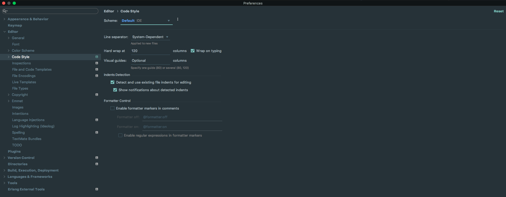
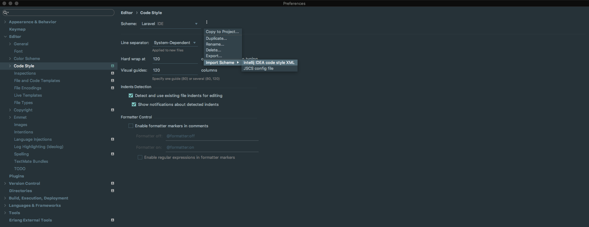

# Custom code Style
This code style is based on the Laravel and the React code styles.  
Feel free to use it and to submit changes if you detect some inconsistencies.

## How to import
1. Open the `PHPStorm > Preferences` panel, then go to `Editor > Code style` Tab.  

2. Once this tab is selected, just click on the icon at the right of the `Schema` option.  

3. Select `Import Scheme > Intellij IDEA code style XML` in the dropdown and select the `phpstorm-laravel-code-style.xml` from this cloned repository.  

4. During the import, name the code style `Custom` and let the `current` checkbox unchecked.
  
5. Select the `Custom` code style in the list, click on the `Apply` button, and to finish, the `Ok` button.

You're done !
